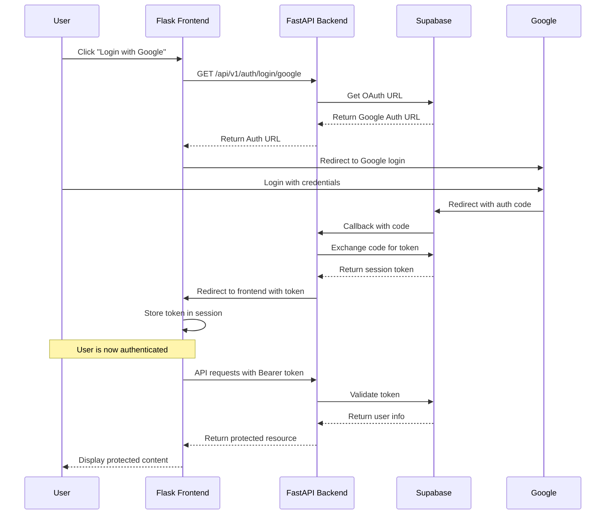

# Flask Frontend Integration

This guide explains how to integrate a Flask frontend with this FastAPI backend using Supabase authentication.

## Authentication Flow

Below is the authentication flow between the Flask frontend, Google OAuth (via Supabase), and the FastAPI backend:



## Flask Frontend Implementation

Here's a sample Flask application that integrates with the backend:

```python
from flask import Flask, redirect, request, session, render_template, flash
import requests
import os

app = Flask(__name__)
app.secret_key = os.environ.get('FLASK_SECRET_KEY', 'dev-secret-key')

API_URL = os.environ.get('API_URL', 'http://localhost:8000')

@app.route('/')
def index():
    # Check if user is logged in
    if 'token' in session:
        return redirect('/dashboard')
    return render_template('index.html')

@app.route('/login')
def login():
    # Redirect to backend auth endpoint
    return redirect(f"{API_URL}/api/v1/auth/login/google")

@app.route('/auth-callback')
def auth_callback():
    # Get token from URL params
    token = request.args.get('token')
    if token:
        # Store token in session
        session['token'] = token
        return redirect('/dashboard')
    else:
        # Handle error
        error = request.args.get('error', 'Unknown error')
        flash(f"Authentication failed: {error}")
        return redirect('/')

@app.route('/dashboard')
def dashboard():
    # Get token from session
    token = session.get('token')
    if not token:
        return redirect('/login')
    
    # Use token to fetch user data
    headers = {'Authorization': f'Bearer {token}'}
    user_response = requests.get(f"{API_URL}/api/v1/auth/me", headers=headers)
    
    if user_response.status_code == 200:
        user_data = user_response.json()
        return render_template('dashboard.html', user=user_data)
    else:
        # Token expired or invalid
        session.pop('token', None)
        return redirect('/login')

@app.route('/items')
def get_items():
    token = session.get('token')
    if not token:
        return redirect('/login')
    
    headers = {'Authorization': f'Bearer {token}'}
    items_response = requests.get(f"{API_URL}/api/v1/items/", headers=headers)
    
    if items_response.status_code == 200:
        items = items_response.json()
        return render_template('items.html', items=items)
    elif items_response.status_code == 401:
        # Unauthorized - token expired
        session.pop('token', None)
        return redirect('/login')
    else:
        flash("Failed to fetch items")
        return redirect('/dashboard')

@app.route('/create-item', methods=['GET', 'POST'])
def create_item():
    token = session.get('token')
    if not token:
        return redirect('/login')
    
    if request.method == 'POST':
        item_data = {
            'title': request.form.get('title'),
            'description': request.form.get('description')
        }
        
        headers = {
            'Authorization': f'Bearer {token}',
            'Content-Type': 'application/json'
        }
        
        response = requests.post(
            f"{API_URL}/api/v1/items/", 
            json=item_data, 
            headers=headers
        )
        
        if response.status_code == 200:
            flash("Item created successfully")
            return redirect('/items')
        elif response.status_code == 401:
            session.pop('token', None)
            return redirect('/login')
        else:
            flash(f"Error creating item: {response.text}")
            
    return render_template('create_item.html')

@app.route('/logout')
def logout():
    session.pop('token', None)
    return redirect('/')

if __name__ == '__main__':
    app.run(debug=True)
```

## Configuration Setup

### Flask Environment Variables

Create a `.env` file in your Flask project:

```
FLASK_APP=app.py
FLASK_ENV=development
FLASK_SECRET_KEY=your-secure-secret-key
API_URL=http://localhost:8000
```

### FastAPI Environment Variables

Make sure your `.env.local` file has the following settings:

```
ENVIRONMENT=development
DEBUG=true
DATABASE_URL=sqlite:///./app.db
SUPABASE_URL=https://your-project-id.supabase.co
SUPABASE_KEY=your-supabase-anon-key
SUPABASE_JWT_SECRET=your-jwt-secret
OAUTH_REDIRECT_URL=http://localhost:8000/api/v1/auth/callback
FRONTEND_URL=http://localhost:5000
CORS_ORIGINS=http://localhost:5000
```

## Flask Templates

Here are some basic templates to get started:

### index.html

```html
<!DOCTYPE html>
<html>
<head>
    <title>Welcome</title>
</head>
<body>
    <h1>Welcome to the Application</h1>
    <a href="/login">Login with Google</a>
</body>
</html>
```

### dashboard.html

```html
<!DOCTYPE html>
<html>
<head>
    <title>Dashboard</title>
</head>
<body>
    <h1>Dashboard</h1>
    <p>Welcome, {{ user.email }}</p>
    <a href="/items">View My Items</a>
    <a href="/create-item">Create New Item</a>
    <a href="/logout">Logout</a>
</body>
</html>
```

### items.html

```html
<!DOCTYPE html>
<html>
<head>
    <title>My Items</title>
</head>
<body>
    <h1>My Items</h1>
    
        <ul>
        
            <li>
                <h3>{{ item.title }}</h3>
                <p>{{ item.description }}</p>
            </li>
        
        </ul>
    
        <p>You don't have any items yet.</p>
    
    <a href="/create-item">Create New Item</a>
    <a href="/dashboard">Back to Dashboard</a>
</body>
</html>
```

### create_item.html

```html
<!DOCTYPE html>
<html>
<head>
    <title>Create Item</title>
</head>
<body>
    <h1>Create New Item</h1>
    <form method="post">
        <div>
            <label for="title">Title:</label>
            <input type="text" id="title" name="title" required>
        </div>
        <div>
            <label for="description">Description:</label>
            <textarea id="description" name="description"></textarea>
        </div>
        <button type="submit">Create Item</button>
    </form>
    <a href="/items">Back to Items</a>
</body>
</html>
```

## Running the Application

1. Start the FastAPI backend:
```bash
python scripts/run.py
```

2. Start the Flask frontend:
```bash
flask run
```

3. Visit `http://localhost:5000` in your browser

4. Click "Login with Google" to start the authentication flow

## Security Considerations

1. **Token Storage**: In production, consider using secure cookies instead of session storage
2. **HTTPS**: Always use HTTPS in production for both backend and frontend
3. **CSRF Protection**: Enable Flask's CSRF protection for forms
4. **Session Security**: Configure Flask's session cookie with secure settings
5. **Token Expiration**: Implement token refresh logic for longer sessions
